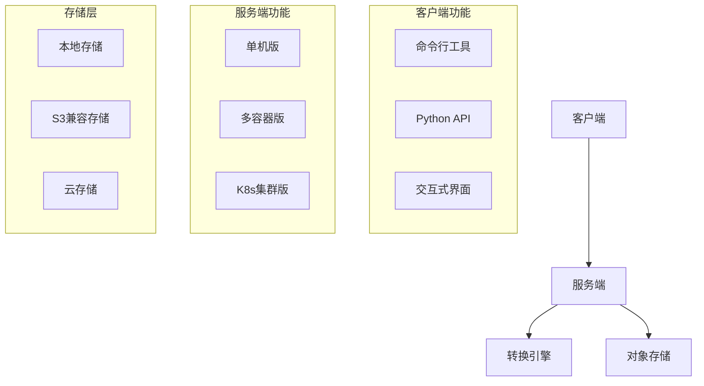
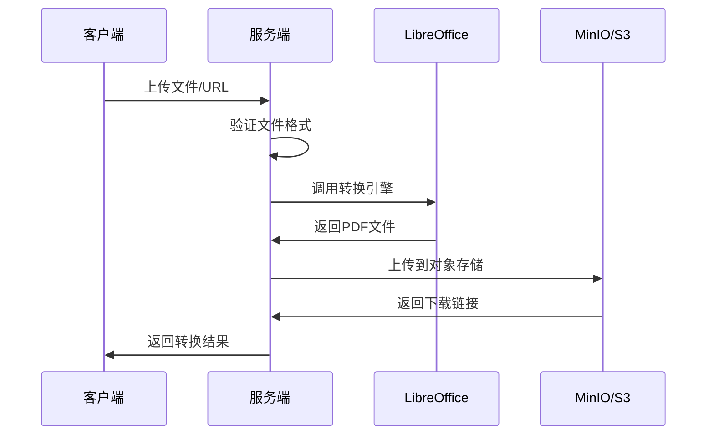

# Convert2PDF 项目结构详解 🏗️

## 📁 整体目录结构

```
convert2pdf_server/
├── 📂 client/                    # 🎯 客户端模块（用户主要使用）
│   ├── 🐍 convert_client.py     # 核心客户端类
│   ├── 🖥️ convert_cli.py        # 命令行工具
│   ├── 🚀 quick_start.py        # 交互式快速开始
│   ├── 📋 requirements.txt      # 客户端依赖
│   ├── 📖 README.md             # 客户端详细文档
│   ├── 📂 examples/             # 使用示例
│   │   ├── simple_example.py    # 简单使用示例
│   │   └── advanced_example.py  # 高级功能示例
│   └── 📂 docs/                 # 客户端相关文档
│
├── 📂 server/                    # 🖥️ 服务端模块
│   ├── 🐍 main.py               # 单机版服务端
│   ├── 🐳 main_multi_docker.py  # 多容器并发版
│   └── 📋 pyproject.toml        # 服务端依赖配置
│
├── 📂 doc/                       # 📚 项目文档
│   ├── 📖 DEVELOPMENT_DOC.md    # 开发维护文档
│   ├── ☸️ README-k8s.md         # Kubernetes部署
│   ├── 📝 TODO.md               # 待办事项
│   ├── 🛠️ minio容器启动方法.md  # MinIO配置
│   └── 📂 assets/               # 文档资源
│
├── 🐳 docker-compose.yml         # Docker Compose配置
├── 🐳 dockerfile                # Docker镜像构建
├── ⚙️ k8s-deployment.yaml       # K8s部署配置
├── ⚙️ k8s-hpa.yaml              # K8s自动扩缩容
├── 📝 k8s端口配置说明.md         # K8s端口配置
├── 🔧 .env                       # 环境变量配置
├── 🔧 .gitignore                # Git忽略规则
├── 🔧 uv.lock                   # UV锁定文件
└── 📖 README.md                 # 项目主文档
```

## 🎯 核心模块说明

### 📱 客户端模块 (`client/`)

**用途**: 为用户提供简单易用的批量转换工具

| 文件 | 功能 | 适用场景 |
|-----|------|---------|
| `convert_client.py` | 核心客户端类库 | 集成到其他项目 |
| `convert_cli.py` | 命令行工具 | 脚本化/批处理 |
| `quick_start.py` | 交互式引导 | 初次使用/快速体验 |
| `requirements.txt` | 依赖管理 | 环境安装 |
| `examples/` | 使用示例 | 学习参考 |

**特点**:
- ✅ 即插即用，只需IP和端口
- ✅ 异步并发，支持高效批量处理
- ✅ 智能重试，内置错误恢复机制
- ✅ 进度显示，实时反馈转换状态

### 🖥️ 服务端模块 (`server/`)

**用途**: 提供高性能的PDF转换服务

| 文件 | 功能 | 适用场景 |
|-----|------|---------|
| `main.py` | 单机版服务端 | 小规模/测试环境 |
| `main_multi_docker.py` | 多容器版本 | 高并发/生产环境 |
| `pyproject.toml` | 依赖配置 | UV包管理 |

**特点**:
- ✅ 支持20+种文件格式
- ✅ 基于LibreOffice转换引擎
- ✅ 集成MinIO/S3对象存储
- ✅ 支持多架构部署

### 📚 文档模块 (`doc/`)

**用途**: 提供完整的项目文档和部署指南

| 文件 | 内容 | 目标用户 |
|-----|------|---------|
| `DEVELOPMENT_DOC.md` | 开发维护指南 | 开发者 |
| `README-k8s.md` | K8s部署方案 | 运维工程师 |
| `TODO.md` | 功能规划 | 贡献者 |
| `minio容器启动方法.md` | 存储配置 | 部署人员 |

## 🚀 使用流程

### 1️⃣ 快速体验流程
```bash
# 1. 进入客户端目录
cd client/

# 2. 安装依赖
pip install -r requirements.txt

# 3. 运行交互式引导
python quick_start.py

# 4. 按提示输入服务端信息和文件路径
# 5. 自动完成批量转换
```

### 2️⃣ 开发集成流程
```python
# 1. 导入客户端
from client.convert_client import ConvertClient

# 2. 创建客户端实例
client = ConvertClient("192.168.1.100", 7758)

# 3. 执行批量转换
results = await client.convert_directory("./documents")

# 4. 处理转换结果
for result in results:
    if result.status == "success":
        print(f"✅ {result.converted_url}")
```

### 3️⃣ 服务端部署流程
```bash
# 1. 进入服务端目录
cd server/

# 2. 配置环境变量
cp .env.example .env
vim .env

# 3. 安装依赖并启动
uv sync
uv run python main.py

# 4. 验证服务
curl http://localhost:7758/health
```

## 🔧 配置文件说明

### 环境变量 (`.env`)
```bash
# MinIO/S3 存储配置
S3_BUCKET_NAME=publicfiles
S3_ACCESS_KEY_ID=your_access_key
S3_SECRET_ACCESS_KEY=your_secret_key
S3_ENDPOINT_URL=http://minio:9000

# 服务配置
PDF_EXPIRE_TIME=3600                  # PDF过期时间(秒)
DOWNLOAD_URL_PREFIX=                  # 下载URL前缀
DOWNLOAD_SSL_VERIFY=false             # SSL验证开关
```

### Docker配置 (`docker-compose.yml`)
- 服务端容器配置
- MinIO存储配置
- 网络和端口映射
- 环境变量注入

### K8s配置 (`k8s-*.yaml`)
- Deployment部署配置
- Service服务暴露
- HPA自动扩缩容
- 持久化存储

## 📊 架构设计

### 整体架构


### 数据流程


## 🎯 使用场景分析

### 场景1: 个人文档转换
- **使用**: `python quick_start.py`
- **特点**: 交互式引导，零配置
- **适合**: 临时需求，少量文件

### 场景2: 项目集成
- **使用**: `from convert_client import ConvertClient`
- **特点**: API调用，可编程
- **适合**: 系统集成，自动化流程

### 场景3: 批量处理
- **使用**: `python convert_cli.py -i ./docs -w 10`
- **特点**: 命令行，高并发
- **适合**: 定时任务，大量文件

### 场景4: 生产部署
- **使用**: Docker/K8s部署
- **特点**: 高可用，可扩展
- **适合**: 企业级，高并发

## 🛠️ 扩展开发

### 添加新的文件格式支持
1. 在 `server/main.py` 中添加格式定义
2. 测试LibreOffice转换能力
3. 更新支持格式列表

### 客户端功能扩展
1. 在 `client/convert_client.py` 中添加新方法
2. 更新CLI工具支持新功能
3. 添加使用示例

### 部署方式扩展
1. 创建新的部署配置文件
2. 编写部署文档
3. 提供部署脚本

## 📈 性能优化建议

### 客户端优化
- 合理设置并发数 (`max_workers`)
- 启用连接池复用
- 实现断点续传

### 服务端优化  
- 使用多容器版本
- 配置负载均衡
- 优化存储访问

### 部署优化
- 使用SSD存储
- 配置CDN加速
- 监控资源使用

---

这个项目结构设计确保了：
- 🎯 **用户友好**: 客户端简单易用
- 🔧 **开发友好**: 代码结构清晰
- 🚀 **部署友好**: 多种部署方案
- 📈 **扩展友好**: 模块化设计