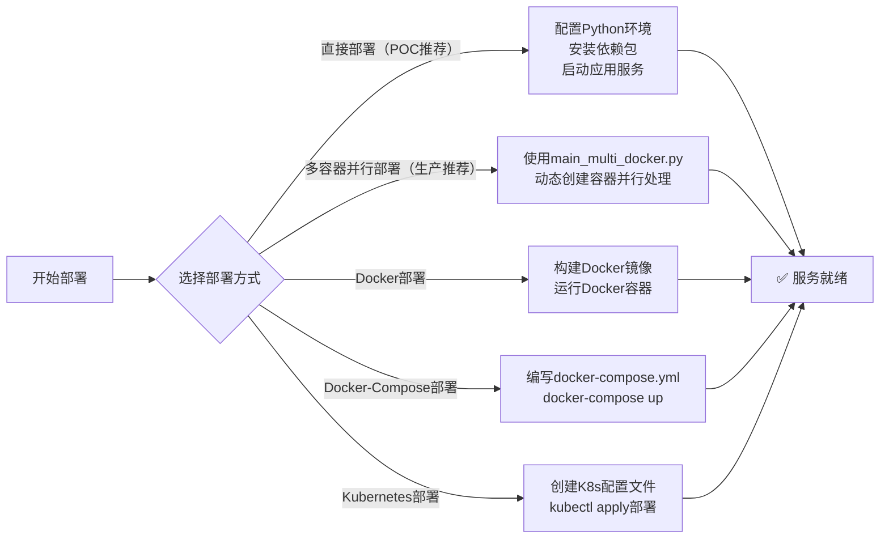
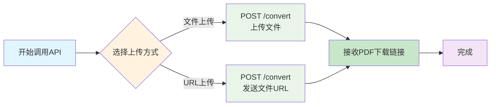

# 文件转 PDF 服务

## 1. 简述

### 1.1 项目说明

**A** **项目出发点**: 是在rag过程中文档有很多文档格式，将文档都转为pdf后可以实现同构，后续的文字提取，图片处理的具体操作只需对pdf一种格式进行处理即可。同时将这个需求抽象出来，多种不同的业务都可以调用这个服务。

**B** **多架构适配**: 同时文件格式转化的工具，很多对操作系统(linux/windows/macos),以及cpu架构（x86/arm64）大多数都有条件依赖，并不通用，换一个客户就要换一种解决方案，本服务也是为了解决这个问题，不管业务方什么操作系统，什么底层架构，均可快速将多格式文档归一为pdf格式，并且信息损失最小。

**C** **概述**: 本服务因为了支持直接部署+容器+高并发生产需求，所以项目整体目录看起来有一定的复杂度。但是**快速开发和简单使用时**，仅需知道核心原理，查看**“直接部署”**的部分和“main.py”即可快速上手，满足基本业务需求。所以不需要有畏难情绪。

### 1.2 快速开始（省流不看版&&部署生产）

> Tips: 省流版部署基于 `ARM64` 架构构建的镜像，仅用于在 `ARM64` 架构上部署
> &emsp;&emsp;&ensp;若要在 `X86` 架构上部署需要按下面流程进行部署

需要先配置存储环境 `MinIO` 参考[minio容器启动方法](./doc/minio容器启动方法.md)

```
# 拉取docker镜像
docker pull swr.cn-north-4.myhuaweicloud.com/wyyy/convert2pdf_server:0.4.0

# 拉取仓库
git clone https://github.com/ppppangu/convert2pdf_server

# 进入项目目录
cd convert2pdf_server

# 使用uv包管理工具同步虚拟环境
uv sync -i https://pypi.tuna.tsinghua.edu.cn/simple

# 编写.env文件配置环境

# 启动
uv run python ./main_multi_docker.py
```

### 1.3 使用服务

**请求示例：**

```bash
curl --location 'http://服务启动的IP:7758/convert' \
--form 'file_url="https://www.bjmtg.gov.cn/bjmtg/2024zcwj/202505/eeeddd638a6c46f6baa96d78673d94ae/files/d45ec828cedf4906baaaedb42c94a319.doc"'
```

**响应示例：**

```json
{
  "status": "success",
  "original_source": "https://www.bjmtg.gov.cn/bjmtg/2024zcwj/202505/eeeddd638a6c46f6baa96d78673d94ae/files/d45ec828cedf4906baaaedb42c94a319.doc",
  "converted_url": "https://149min9000.cpolar.cn/publicfiles/convert_file2pdf_server/1755771316.037417_d45ec828cedf4906baaaedb42c94a319.pdf",
  "original_url": "https://www.bjmtg.gov.cn/bjmtg/2024zcwj/202505/eeeddd638a6c46f6baa96d78673d94ae/files/d45ec828cedf4906baaaedb42c94a319.doc"
}
```


## 2. 使用流程一览

### 2.1 部署



### 2.2 调用



## 3. 特点

> 1、高效、轻量的文件格式转 PDF 服务，基于 LibreOffice 实现转换，使用 MinIO/S3 兼容对象存储保存转换结果；
>
> 2、支持二十多种格式的文件转pdf（LibreOffice支持的都支持，详情见main.py）
>
> 3、支持文件自动过期，无需手动管理中间文件的硬盘空间占用；
>
> 4、可根据业务需求自行选择：直接部署服务，multi_docker多容器并行部署，docker/docker-compose部署，k8s部署；
>
> 5、三种部署方式均支持并发，属于cpu密集型任务；
>
> 6、windows，linux，macos，不管是x86还是arm64均可部署完整服务（核心是libreoffice部署上就行，这个开源工具也正好基本支持全架构全操作系统，即使不支持也能用容器）；
>
> 6、二次开发：可给main中增加要转换的格式入参，通过中间格式，实现任意目标格式的转换服务；支持更多的功能等。

# 3.+ 补充

**解决问题点**

> 1. 开发上：做RAG/其他任务时，用户给到了多种文件，导致在写处理逻辑时n种文件格式就要找n种解析方式，稀奇古怪的格式更甚。
> 2. 开发上：统一格式的选择上，统一为txt文档的解决方案会损失很多多模态信息，md文档会损失位置信息，加之大多数的OCR工具均是对pdf进行处理，综合考量下来pdf相对最优。
> 3. 部署上：即使统一格式，也可能会出现因开发环境和给客户部署的环境在系统架构（arm/amd），操作系统类型，离线/在线的不同临时出现问题。

**部署方式的选择**

> 1、**常规客户业务** **直接部署**即可;
>
> **2、刁钻的** **操作系统** **/离线环境**用 **docker部署** ;
>
> **3、高并发**到前两种服务的请求error率变高时选用 **k8s部署** 。

---

## 4. 前置知识说明

> 省流：
>
> 1、必须要学的：**tmux**用于后台挂起服务，**uv**用于虚拟环境的快速同步；
>
> 2、其他项目也要用的，但是本项目里不用也行的：docker的使用（进阶把docker-compose也看了，非复杂任务可以先不看）；
>
> 3、会了的话对其他项目也有帮助的：minio云存储，**cpolar内网穿透工具**（极大提高对接效率）；
>
> 4、仅本需求点用的工具：libreoffice；
>
> 5、全学会了再学的：k8s，短期可以先不看；
>
> 总结：tmux，uv，cpolar必学的

1. 首先需要对核心工具**libreoffice**的有基础了解；
2. 需要了解**对象存储minio**的一些基本概念，相关前置知识自行搜索，知道如何配置即可；
3. 直接部署时需要了解**uv**的使用，**tmux**终端会话工具；
4. docker/docker-compose部署时需要了解**docker**，**docker-compose的部署和使用方式，配置原理**；
5. k8s部署还需要了解k8s的部署，配置和使用；
6. 根据业务需求时间，自身知识程度，部署情况等因素灵活选择部署方式；

---

## 5. 部署先决条件

根据不同的部署方式，所需的前置环境有所不同。根据选择的部署方式查看对应的要求即可，不需要全会。

### 方式一：裸机/虚拟环境部署 - 前置环境

> 适用于快速验证、开发调试、小规模使用

| 组件            | 说明                                         | 最低版本     | 安装指导                                                                                                                              |
| --------------- | -------------------------------------------- | ------------ | ------------------------------------------------------------------------------------------------------------------------------------- |
| **Python**      | Python 运行时环境                            | 3.12         | [官网下载](https://www.python.org/downloads/)                                                                                         |
| **uv**          | Python 包管理工具（推荐）                    | 最新版       | `pip install uv` 或 [官方安装指南](https://docs.astral.sh/uv/getting-started/installation/)                                           |
| **LibreOffice** | 核心转换引擎，确保 `soffice` 命令可用        | 7.x          | [官网下载](https://www.libreoffice.org/download/download/) 或 `sudo apt install libreoffice`，windows/linux/macos均可下载，具体查csdn |
| **MinIO/S3**    | 对象存储服务，需要创建 Bucket 并获取访问密钥 | 任意兼容版本 | [MinIO 部署指南](https://min.io/docs/minio/linux/operations/installation.html)                                                        |

**LibreOffice 安装验证**：

```bash
# 验证安装是否成功，linux在终端执行，windows在cmd/powershell执行
soffice --version
# 应该输出类似：LibreOffice 7.x.x.x
```

### 方式二：Docker/Docker-Compose部署 - 前置环境

> 推荐用于生产环境的单机/小集群部署

| 组件               | 说明                                         | 最低版本     | 安装指导                                            |
| ------------------ | -------------------------------------------- | ------------ | --------------------------------------------------- |
| **Docker**         | 容器运行时                                   | 23.x         | [官方安装指南](https://docs.docker.com/get-docker/) |
| **Docker Compose** | 容器编排工具（通常与 Docker 一起安装）       | 2.x          | `docker compose version` 验证，有文档               |
| **MinIO/S3**       | 对象存储服务，需要创建 Bucket 并获取访问密钥 | 任意兼容版本 | 可通过 Docker 部署或使用云服务                      |

**Docker 安装验证**：

```bash
# 验证 Docker 安装
docker --version
docker compose version

# 测试 Docker 运行
docker run hello-world
```

**注意**：Docker 方式中 LibreOffice 和 Python 环境已经打包在镜像中，无需单独安装。

### 方式三：Kubernetes部署 - 前置环境

> 适用于大规模并发、弹性伸缩场景（>50 并发）

| 组件             | 说明                                                  | 最低版本     | 安装指导                                                                |
| ---------------- | ----------------------------------------------------- | ------------ | ----------------------------------------------------------------------- |
| **Kubectl**      | Kubernetes 命令行工具                                 | 1.26+        | [官方安装指南](https://kubernetes.io/docs/tasks/tools/install-kubectl/) |
| **Kubernetes**   | 容器编排平台（集群）                                  | 1.26+        | 需要已有 K8s 集群或自建                                                 |
| **Docker**       | 用于构建和推送镜像到私有仓库                          | 23.x         | [官方安装指南](https://docs.docker.com/get-docker/)                     |
| **容器镜像仓库** | 存储应用镜像（如 Harbor、Docker Hub、云厂商镜像仓库） | -            | 根据选择的仓库查看文档，我用的话华为云的镜像仓库服务                    |
| **MinIO/S3**     | 对象存储服务，建议使用云服务或集群内部署              | 任意兼容版本 | 推荐使用云服务保证高可用                                                |

**Kubernetes 环境验证**：

```bash
# 验证集群连接
kubectl cluster-info
kubectl get nodes

# 验证权限
kubectl auth can-i create deployments
kubectl auth can-i create services
```

### 通用环境变量配置（重中之重）

**所有部署方式都需要配置以下环境变量，直接部署的话直接改.env文件即可，其他两种需要进行容器环境变量的配置**：

```bash
# MinIO/S3 配置
S3_BUCKET_NAME=publicfiles            # 存储桶名称
S3_ACCESS_KEY_ID=<your-access-key>     # 访问密钥ID
S3_SECRET_ACCESS_KEY=<your-secret-key> # 访问密钥Secret
S3_REGION=<your-region>                # 可选，MinIO 可忽略
S3_ENDPOINT_URL=http://minio:9000      # MinIO/S3 端点

# 服务配置
PDF_EXPIRE_TIME=3600                   # PDF 过期时间（秒），0 表示永不过期
DOWNLOAD_URL_PREFIX=                   # 若有反向代理，或者是内网穿透开放了9000端口，可指定转化完成后文件的下载前缀
```

**MinIO/S3 配置说明**：

- 确保指定的 Bucket 已创建且具有读写权限
- AccessKey 和 SecretKey 需要有对应 Bucket 的操作权限
- 如使用 MinIO，endpoint 格式为 `http://ip:port`
- 如使用 AWS S3，可省略 `S3_ENDPOINT_URL`

---

## 6. 部署

### 部署方式一：裸机 / 虚拟环境（**uv**）【POC推荐】

> 适用于快速验证、小规模使用。

```bash
# 部署前检查1，检查uv已下载，如果没有，则使用pip install uv下载
pip show uv
# 部署前检查2，检查系统环境下libreoffice已下载，如果没有，则使用apt install libreoffice下载。以及要支持更多字体的话，参考dockerfile中的apt下载命令执行一遍下载即可
soffice --version
# 部署前检查3，minio存储服务是否正确启动
# 这部分在下面uv run python main.py时的startup事件里进行检查

# tmux创建一个新的session
tmux

# 制作总项目目录
mkdir -p /data/project1
cd /data/project1

# 拉取仓库
git clone https://github.com/ppppangu/convert2pdf_server

# 进入项目目录
cd convert2pdf_server

# 使用uv包管理工具同步虚拟环境
uv lock
uv sync -i https://pypi.tuna.tsinghua.edu.cn/simple

# vim编辑.env 虚拟环境,配置相关的存储服务
vim .env

# 起服务，默认运行在7758端口上
uv run python main.py

# 挂起终端：ctrl+b 再按d
# 后续重新进入的话需看一下tmux的文档熟练使用
```

**热更新 / 生产环境**：可配合 `gunicorn` + `uvicorn.workers.UvicornWorker` 部署，或自行使用 `systemd / supervisor` 进行守护。（不推荐，直接起就行）

---

### 部署方式二：Docker / Docker-Compose

> 推荐用于生产环境的单机 / 小集群部署。

1. **修改 `docker-compose.yml` 中的环境变量**（见前述先决条件）。
2. **启动服务**：
   ```bash
   $ docker compose up -d   # 首次会自动构建镜像
   # 或使用已有镜像（示例）：
   # $ docker compose -f docker-compose.yml -f docker-compose.prod.yml up -d
   ```
3. **验证**：
   ```bash
   $ curl http://localhost:7758/health  # 返回 {"status":"ok"} 即成功
   ```

---

### 部署方式三：Kubernetes（大并发 / 弹性伸缩）

> 当预计并发转换量较大（>50 并发）时，建议使用 K8s，通过副本数或 HPA 横向扩展。

完整部署指南请参见 [`README-k8s.md`](./doc/README-k8s.md)。该文档包含：

- 镜像准备与私有仓库推送
- `Deployment` / `Service` / `Ingress` 示范 YAML
- 日志持久化 PVC
- HPA 自动扩缩容配置

---

## 7. 服务调用（后端直接调用服务端）

部署完成后，即可通过以下 REST API 进行调用。

| 接口                        | 方法 | 描述                                           |
| --------------------------- | ---- | ---------------------------------------------- |
| `/health`                   | GET  | 健康检查                                       |
| `/get_supported_file_types` | GET  | 获取服务支持的文件扩展名                       |
| `/convert`                  | POST | 文件转 PDF（支持**URL 下载** 或 **直接上传**） |

### 1. 健康检查

```bash
curl http://<host>:<port>/health   # {"status":"ok"}
```

### 2. 获取支持的文件类型

```bash
curl http://<host>:<port>/get_supported_file_types
```

**响应示例（不止）:**

```json
{
  "supported_file_types": [
    ".doc", ".docx", ".ppt", ".pptx", ".xls", ".xlsx",
    ".odt", ".ods", ".odp", ".txt", ".rtf",
    ".jpg", ".jpeg", ".png", ".tiff", ".tif", ".bmp",
    ".html", ".htm", ".md", ".csv", ".tsv", ".xml"
  ]
}
```

### 3. 转换文件

方式一：通过文件 URL

```bash
curl -X POST http://<host>:<port>/convert \
  -F "file_url=https://example.com/sample.docx"
```

方式二：直接上传文件（初学者**推荐**直接上传，使用文件url对接更方便但是需要"手动上传到S3存储+内网穿透"的部署）

```bash
curl -X POST http://<host>:<port>/convert \
  -F "file=@/path/to/local/sample.docx"
```

成功响应示例：

```json
{
  "status": "success",
  "original_source": "https://example.com/sample.docx",
  "converted_url": "http://minio:9000/publicfiles/convert_file2pdf_server/1710000000_sample.pdf"
}
```

> **提示**：如需跨域调用，服务已默认启用 `*` CORS 策略。

---

## 8. 服务调用（快速开始）

### 客户端使用（推荐） # 交互式引导

```bash
# 1. 进入客户端目录
cd client/

# 2. 安装依赖
pip install -r requirements.txt

# 3. 运行快速开始脚本
python quick_start.py
```

然后按提示输入服务端IP、端口和文件目录即可！

### 💼 开发者 / 集成使用
```python
# 3行代码实现批量转换
from convert_client import ConvertClient
client = ConvertClient("192.168.1.100", 7758)
results = await client.convert_directory("./documents")
```

### 🖥️ 命令行用户
```bash
cd client/
python convert_cli.py -H 192.168.1.100 -p 7758 -i ./documents -w 10
```

## ✨ 核心特性

### 客户端特性
- **🔌 即插即用**: 只需配置服务端IP和端口
- **⚡ 异步并发**: 支持高并发转换，大幅提升效率  
- **🔄 智能重试**: 内置指数退避重试机制
- **📊 实时进度**: 实时显示转换进度和统计信息
- **📁 批量处理**: 支持目录递归搜索
- **💾 结果保存**: 自动保存转换结果和报告

### 服务端特性
- **🏃‍♂️ 高性能**: 基于LibreOffice，支持20+种文件格式
- **🐳 多部署**: 支持裸机/Docker/K8s部署
- **☁️ 云存储**: 集成MinIO/S3对象存储
- **🔄 多架构**: 支持x86/ARM64，Linux/Windows/macOS
- **📈 可扩展**: 支持水平扩展和负载均衡

## 🎬 使用演示

### 最简使用 - 3行代码
```python
import asyncio
from client.convert_client import ConvertClient

async def main():
    client = ConvertClient("192.168.1.100", 7758)
    results = await client.convert_directory("./my_documents")
    print(f"转换完成！成功: {sum(1 for r in results if r.status == 'success')} 个")

asyncio.run(main())
```

## 📚 详细文档

- **[客户端使用文档](./client/README.md)** - 详细的客户端使用指南
- **[服务端部署文档](./doc/)** - 完整的服务端部署方案
- **[开发文档](./doc/DEVELOPMENT_DOC.md)** - 二次开发和维护指南
- **[K8s部署文档](./doc/README-k8s.md)** - 大规模部署方案

## 🔧 部署方案选择

| 场景 | 推荐方案 | 部署复杂度 | 适用规模 |
|------|---------|-----------|---------|
| **快速体验** | 客户端 + 现有任意服务 | ⭐ | 个人使用 |
| **小规模业务** | 裸机部署main服务端 | ⭐⭐ | < 10并发 |
| **生产环境** | multidocker.py部署 | ⭐⭐⭐ | 10-100并发 |
| **超高并发** | K8s + 多副本 | ⭐⭐⭐⭐ | > 100并发 |

## 一些说明

1、表格文件支持转化，但是涉及表格精细操作的业务最好单独写业务逻辑。

## 🤝 贡献 & 反馈

- 🐛 **Bug报告**: [提交Issue](https://github.com/ppppangu/convert2pdf_server/issues)
- 💡 **功能建议**: 欢迎提出改进建议，要有更高的通用性还需更加优化，有需求提issue
- 🔧 **代码贡献**: 如需贡献，提交 PR 或 issue。更新日志请查看 Releases。
- 📖 **文档完善**: 若要维护请查看帮助改进文档[DEVELOPMENT_DOC.md](./doc/DEVELOPMENT_DOC.md) 文档。

## 📄 许可证

本项目采用开源许可证，欢迎自由使用和修改。

---

**🎉 现在就开始使用吧！**

1. **想快速体验？** → `cd client/ && python quick_start.py`
2. **想集成到项目？** → 查看 [客户端文档](./client/README.md)  
3. **想部署服务？** → 查看 [服务端文档](./doc/)
