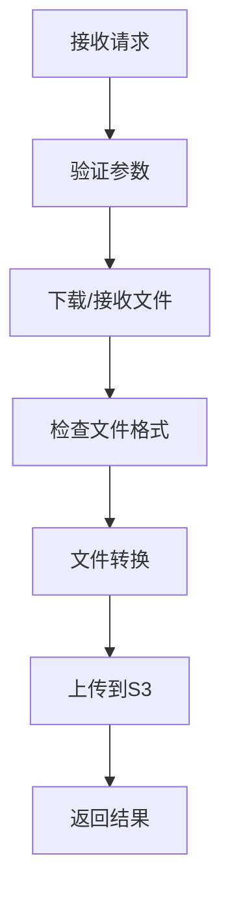

# Convert2PDF Server 开发文档

## 项目概述

Convert2PDF Server 是一个高性能的文件格式转换服务，支持将多种文档格式转换为PDF。项目提供了两种实现方式：

1. `main.py` - 直接使用 LibreOffice 进行文件转换
2. `main_multi_docker.py` - 使用 Docker 容器进行分布式文件转换

### 主要特性

- **多种文件格式支持**：支持文档、电子表格、演示文稿、绘图等多种格式
- **灵活的输入方式**：支持文件URL下载和直接文件上传
- **云存储集成**：集成 S3/MinIO 云存储
- **高可用性**：支持 Docker 容器化部署和水平扩展
- **详细日志**：完整的操作日志记录和错误追踪

---

## 架构设计

### 整体架构

```
┌─────────────────┐    ┌─────────────────┐    ┌─────────────────┐
│   Web Client    │────│  Convert2PDF    │────│   S3/MinIO      │
│                 │    │    Server       │    │   Storage       │
└─────────────────┘    └─────────────────┘    └─────────────────┘
                                │
                                ▼
                       ┌─────────────────┐
                       │  LibreOffice    │
                       │   (Docker)      │
                       └─────────────────┘
```

### 技术栈

- **Web框架**：Starlette (异步Web框架)
- **文件转换**：LibreOffice (Docker容器化)
- **云存储**：MinIO/S3 兼容
- **日志管理**：Loguru
- **环境配置**：python-dotenv
- **容器化**：Docker + Docker Compose

---

## API 接口说明

### 基础信息

- **基础URL**：`http://localhost:7758`
- **内容类型**：`multipart/form-data` (文件上传) 或 `application/x-www-form-urlencoded` (URL传递)
- **响应格式**：JSON

### 接口列表

#### 1. 健康检查接口

**GET** `/health`

检查服务是否正常运行。

**响应示例**：
```json
{
  "status": "ok"
}
```

#### 2. 获取支持的文件类型

**GET** `/get_supported_file_types`

获取服务支持的所有文件格式列表。

**响应示例**：
```json
{
  "supported_file_types": [
    ".doc", ".docx", ".pdf", ".txt", ".html",
    ".xls", ".xlsx", ".ppt", ".pptx", ".odt", ".ods", ".odp",
    // ... 更多格式
  ]
}
```

#### 3. 文件转换接口

**POST** `/convert`

将文件转换为PDF格式。

**请求参数**：

| 参数名     | 类型   | 必填 | 说明          |
| ---------- | ------ | ---- | ------------- |
| `file_url` | string | 否   | 文件的URL地址 |
| `file`     | file   | 否   | 上传的文件    |

**注意**：
- `file_url` 和 `file` 参数二选一，优先使用 `file_url`
- 支持的文件格式请参考 `/get_supported_file_types` 接口
- 已为PDF的文件将返回错误

**成功响应示例**：
```json
{
  "status": "success",
  "original_source": "https://example.com/document.docx",
  "converted_url": "https://s3.example.com/bucket/convert_file2pdf_server/1234567890.123_document.pdf"
}
```

**错误响应示例**：
```json
{
  "error": "file type not supported, given file type is: exe"
}
```

---

## 配置说明

### 环境变量配置

项目使用 `.env` 文件管理配置，系统环境变量优先级高于 `.env` 文件。

#### S3/MinIO 配置

| 变量名                 | 必填 | 默认值 | 说明           |
| ---------------------- | ---- | ------ | -------------- |
| `S3_BUCKET_NAME`       | 是   | -      | S3存储桶名称   |
| `S3_ACCESS_KEY_ID`     | 是   | -      | S3访问密钥ID   |
| `S3_SECRET_ACCESS_KEY` | 是   | -      | S3秘密访问密钥 |
| `S3_REGION`            | 否   | -      | S3区域         |
| `S3_ENDPOINT_URL`      | 是   | -      | S3端点URL      |

#### 其他配置

| 变量名                | 必填 | 默认值  | 说明                                 |
| --------------------- | ---- | ------- | ------------------------------------ |
| `PDF_EXPIRE_TIME`     | 否   | 0       | PDF文件过期时间(秒)，0表示不设置过期 |
| `DOWNLOAD_URL_PREFIX` | 否   | ""      | 自定义下载URL前缀                    |
| `DOWNLOAD_SSL_VERIFY` | 否   | "false" | 下载时是否验证SSL证书                |

### 示例 .env 文件

```bash
# S3/MinIO 配置
S3_BUCKET_NAME=your-bucket-name
S3_ACCESS_KEY_ID=your-access-key
S3_SECRET_ACCESS_KEY=your-secret-key
S3_REGION=us-east-1
S3_ENDPOINT_URL=https://s3.amazonaws.com

# 可选配置
PDF_EXPIRE_TIME=86400
DOWNLOAD_URL_PREFIX=https://cdn.example.com
DOWNLOAD_SSL_VERIFY=true
```

1. **部署应用**：
```bash
kubectl apply -f k8s-deployment.yaml
kubectl apply -f k8s-hpa.yaml
```

---

## 开发指南

### 代码结构

```
convert2pdf_server/
├── main.py                    # 直接转换版本
├── main_multi_docker.py        # Docker容器转换版本
├── .env                       # 环境变量配置
├── pyproject.toml             # 项目依赖
├── dockerfile                 # Docker构建文件
├── docker-compose.yml         # Docker Compose配置
├── k8s-deployment.yaml        # K8s部署配置
├── k8s-hpa.yaml              # K8s自动扩缩容配置
└── logs/                     # 日志目录(自动创建)
    └── log_YYYY-MM-DD_HH-MM-SS.log
```

### 核心功能实现

#### 1. 文件格式支持

项目支持6大类文件格式：

- **文档格式**：`.doc`, `.docx`, `.odt`, `.rtf`, `.txt`, `.html`, `.xml` 等
- **电子表格**：`.xls`, `.xlsx`, `.ods`, `.csv`, `.tsv` 等
- **演示文稿**：`.ppt`, `.pptx`, `.odp` 等
- **绘图图形**：`.odg`, `.vsd`, `.svg`, `.png`, `.jpg` 等
- **数据库**：`.odb`, `.mdb`, `.accdb`, `.csv` 等
- **数学公式**：`.odf`, `.mml` 等

#### 2. 转换流程



#### 3. Docker容器管理 (main_multi_docker.py)

`main_multi_docker.py` 使用 Docker 容器进行文件转换：

```python
# 创建Docker客户端
def create_docker_client():
    return docker.from_env()

# 转换文件
async def convert_file_with_docker(file_url=None, file_path=None):
    # 1. 启动Docker容器
    # 2. 等待容器启动完成
    # 3. 发送转换请求
    # 4. 清理容器资源
```

#### 4. 直接转换 (main.py)

`main.py` 直接使用 LibreOffice 命令行工具：

```python
# 使用 LibreOffice 转换
process = await asyncio.create_subprocess_exec(
    "soffice",
    "--headless",
    "--convert-to", "pdf",
    file_path,
    "--outdir", output_dir
)
```

### 开发环境设置

1. **安装开发依赖**：
```bash
# 安装 uv (推荐)
curl -LsSf https://astral.sh/uv/install.sh | sh
uv sync
```

2. **运行测试**：
```bash
# 运行单测 (如果有)
uv run pytest

# 运行开发服务器
uv run python main.py
```

3. **代码格式化**：
```bash
# 格式化代码
uv run black .
uv run isort .
```

### 日志管理

项目使用 Loguru 进行日志管理：

- **日志位置**：`logs/log_YYYY-MM-DD_HH-MM-SS.log`
- **日志轮转**：100MB 自动轮转
- **日志保留**：1000天
- **日志级别**：INFO (默认)

```python
# 日志配置
logger.add(
    log_file,
    rotation="100 MB",
    retention="1000 days"
)
```

---

## 故障排除

### 常见问题

#### 1. Docker 相关问题

**问题**：`Failed to create Docker client`
**解决**：
- 确保 Docker 服务正在运行
- 检查用户权限：`sudo usermod -aG docker $USER`
- 重启 Docker 服务：`sudo systemctl restart docker`

**问题**：容器启动失败
**解决**：
- 检查 Docker 镜像是否存在：`docker pull swr.cn-north-4.myhuaweicloud.com/wyyy/convert2pdf_server:0.4.0`
- 查看容器日志：`docker logs <container_name>`

#### 2. 文件转换问题

**问题**：`Failed to convert file`
**解决**：
- 检查 LibreOffice 是否正确安装
- 确认文件格式是否支持
- 查看详细日志信息
- 检查文件是否损坏

**问题**：`file type not supported`
**解决**：
- 调用 `/get_supported_file_types` 接口查看支持的格式
- 检查文件扩展名是否正确

#### 3. S3/MinIO 问题

**问题**：`Failed to upload file to storage`
**解决**：
- 检查 S3 配置是否正确
- 确认存储桶是否存在
- 验证访问凭据
- 检查网络连接

#### 4. 内存和性能问题

**问题**：内存使用过高
**解决**：
- 使用 Docker 版本，支持容器资源限制
- 配置适当的内存限制
- 监控系统资源使用情况

### 调试技巧

1. **启用调试日志**：
```bash
# 临时修改日志级别
logger.add(sys.stderr, level="DEBUG")
```

2. **查看临时文件**：
```bash
# 检查 tmp 目录
ls -la tmp/
```

3. **监控 Docker 容器**：
```bash
# 查看运行中的容器
docker ps

# 查看容器日志
docker logs -f <container_name>
```

### 性能优化建议

1. **使用 Docker 版本**：支持多实例部署，提高并发处理能力
2. **合理配置超时**：根据文件大小调整超时设置
3. **定期清理临时文件**：防止磁盘空间不足
4. **使用对象存储**：减轻本地存储压力

---

## 版本差异说明

### main.py vs main_multi_docker.py

| 特性           | main.py              | main_multi_docker.py |
| -------------- | -------------------- | ------------------- |
| **转换方式**   | 直接调用 LibreOffice | Docker 容器         |
| **并发处理**   | 单进程               | 多容器实例          |
| **资源隔离**   | 无                   | 容器级别隔离        |
| **部署复杂度** | 简单                 | 需要 Docker 环境    |
| **扩展性**     | 有限                 | 支持水平扩展        |
| **适用场景**   | 开发/测试环境        | 生产环境            |

### 选择建议

- **开发/测试环境**：推荐使用 `main.py`，部署简单，易于调试
- **生产环境**：推荐使用 `main_multi_docker.py`，支持高并发和水平扩展
- **资源受限环境**：使用 `main.py`，资源占用较少
- **高负载场景**：使用 `main_multi_docker.py`，支持多实例负载均衡

---

## 安全注意事项

1. **环境变量保护**：不要将 `.env` 文件提交到版本控制系统
2. **网络安全**：
   - 配置适当的防火墙规则
   - 使用 HTTPS 进行通信
   - 验证 SSL 证书
3. **访问控制**：
   - 限制 API 访问
   - 使用身份验证机制
   - 监控异常访问
4. **文件安全**：
   - 验证文件类型
   - 限制文件大小
   - 定期清理临时文件

---

## 贡献指南

1. **代码规范**：
   - 遵循 PEP 8 编码规范
   - 使用有意义的变量和函数名
   - 添加适当的注释和文档字符串

2. **提交规范**：
   - 使用清晰的提交消息
   - 每个功能提交一个独立的PR
   - 包含必要的测试

3. **测试要求**：
   - 添加单元测试
   - 测试边界条件
   - 验证错误处理

---

## 许可证

本项目采用 MIT 许可证，详见 LICENSE 文件。

---

## 联系方式

如有问题或建议，请通过以下方式联系：

- 提交 GitHub Issue
- 发送邮件至项目维护者
- 参与项目讨论

---

**最后更新时间**：2025年8月22日
**文档版本**：v1.0.0
