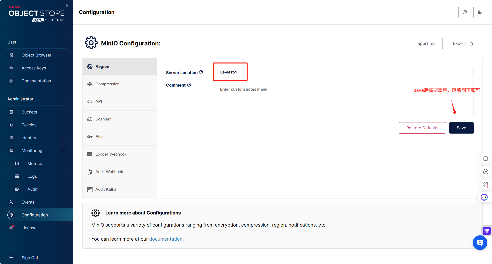

# minio容器启动方法

公网ip:

1、进入相关目录(**注意必须要有足够的磁盘空间！！！**)

```bash
cd /data/v2/minio_storage
```

2、启动容器

```bash
docker run -p 9000:9000 -p 9001:9001 --name minio -d --restart=always \
  -e "MINIO_ROOT_USER=YourUserName" \
  -e "MINIO_ROOT_PASSWORD=YourPassword" \
  -v ./data:/data \
  minio/minio:RELEASE.2025-03-12T18-04-18Z server /data \
  --address ":9000" \
  --console-address ":9001"
```

> MinIO容器需要使用早期版本，由于几个月之后把`GUI`界面删了，该版本与早期版本是可以的

3、创建区域，设置为AWS默认区域

```bash
us-east-1
```



4、创建桶，设为公共桶


5、创建ak，sk

实例ak，sk记录

```bash
ak:DeeiWtJ14aL
sk:BjPaFyy
```


补充格式设置：


application/msword

application/pdf

application/vnd.openxmlformats-officedocument.wordprocessingml.document
